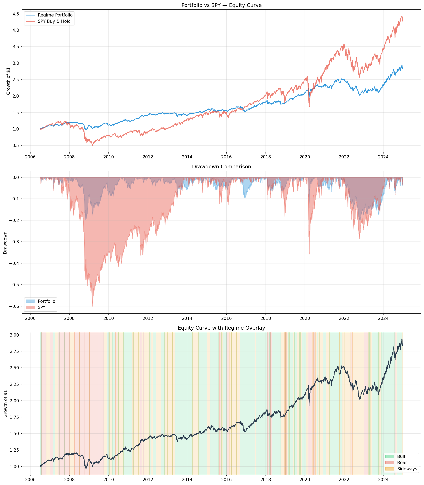

# Regime Adaptive Portfolio

Algorithmic portfolio optimizer that detects market regimes using a Hidden Markov Model and dynamically switches between optimization strategies.

 

## How it works

1. **Regime Detection**   A 3-state Gaussian HMM trained on SPY log returns, rolling volatility, and rolling correlation labels each trading day as Bull, Bear, or Sideways
2. **Adaptive Optimization**   Weights are recomputed at each regime change using the appropriate optimizer:
   - Bull → Mean-Variance (maximize Sharpe ratio)
   - Bear → Risk Parity (equalize risk contributions)
   - Sideways → Minimum Variance (minimize portfolio volatility)
3. **Backtest**   Lookahead-free simulation applying t-day weights to t+1 returns across 20 years of data

## Results (2005–2025)

| Metric                | Portfolio | SPY Buy & Hold |
|-----------------------|-----------|----------------|
| Annualized Return     | 5.44%     | 8.51%          |
| Annualized Volatility | 8.71%     | 19.14%         |
| Sharpe Ratio          | 0.17      | 0.24           |
| Max Drawdown          | -20.49%   | -59.58%        |
| Calmar Ratio          | 0.27      | 0.14           |

The strategy accepts lower absolute returns in exchange for significantly reduced drawdown and volatility. Max drawdown is less than a third of SPY's   during the 2008 financial crisis the portfolio stayed above water while SPY lost nearly 60%.

## Charts



## Architecture

```
regime-adaptive-portfolio/
├── data/
│   ├── fetch.py           # Downloads adjusted close prices via yfinance (SPY, TLT, GLD, EFA, IEF)
│   └── process.py         # Computes log returns, 21-day volatility, 63-day mean correlation
├── models/
│   └── hmm.py             # 3-state Gaussian HMM   labels each day as Bull, Bear, or Sideways
├── optimization/
│   ├── mean_var.py        # Mean-Variance max Sharpe via convex QP (Bull regime)
│   ├── risk_parity.py     # Risk Parity via log barrier formulation (Bear regime)
│   ├── min_variance.py    # Minimum Variance QP (Sideways regime)
│   └── switcher.py        # Routes to correct optimizer, enforces lookahead prevention
├── backtest/
│   ├── engine.py          # Simulates portfolio returns, builds equity curve
│   ├── metrics.py         # Annualized return, volatility, Sharpe, max drawdown, Calmar
│   └── benchmark.py       # SPY buy-and-hold comparison
├── visualization/
│   └── charts.py          # Equity curves, drawdown comparison, regime overlay
└── main.py                # Full pipeline entry point
```

## Stack

| Library    | Purpose                    |
|------------|----------------------------|
| yfinance   | Price data download        |
| hmmlearn   | Gaussian HMM implementation|
| cvxpy      | Convex optimization solver |
| pandas / numpy | Data manipulation      |
| matplotlib | Visualization              |
| joblib     | Model persistence          |

## Usage

```bash
# Install dependencies
pip install yfinance hmmlearn cvxpy pandas numpy matplotlib joblib pyarrow

# Run full pipeline (loads cached HMM model)
python main.py

# Force HMM retrain from scratch
python main.py --retrain

# Run without generating charts
python main.py --no-charts
```

## Key Design Decisions

**Why Gaussian HMM?** Markets exhibit persistent regimes  Bull markets tend to stay bullish, Bear markets tend to stay bearish. The HMM transition matrix captures this persistence. Gaussian emissions model the continuous feature space (returns, volatility, correlation) naturally.

**Why these three optimizers?** Each regime has a different risk-return objective. In Bull markets you want to capture upside   Mean-Variance does this. In Bear markets correlations spike and equities crash   Risk Parity naturally underweights equities. In Sideways markets there is no reliable signal   Minimum Variance just preserves capital.

**Why no short selling?** Weight constraints w >= 0 reflect realistic constraints for most investors and prevent the optimizer from taking leveraged bets based on noisy return estimates.

**Lookahead prevention**  The switcher always slices returns.loc[:date] before passing to any optimizer. Weights on day t are only ever computed using information available on day t.

## Limitations

- Transaction costs and slippage not modeled
- HMM trained on full history rather than rolling walk-forward retraining
- Regime switching frequency may be too high for practical implementation
- Limited asset universe (5 ETFs)

## Author

Abdelkrim   Applied Mathematics & AI, PSL-Dauphine
https://github.com/AbdelkrimCode
