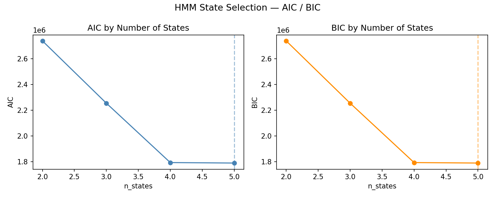
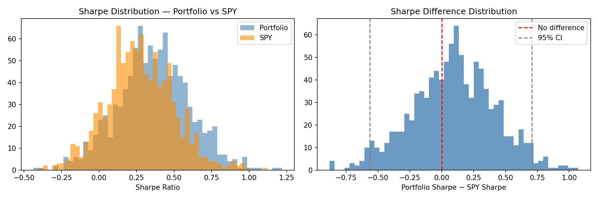

# Regime Adaptive Portfolio — v2

Algorithmic portfolio optimizer combining Hidden Markov Model regime detection with convex optimization. v2 introduces statistically validated regime selection, posterior probability blending, a 4-state model with Crash regime, time-varying risk-free rate, cost-adjusted benchmarks, bootstrap significance testing, and a held-out test period.

 

---

## How It Works

### 1. Regime Detection
A Gaussian HMM trained on three features — SPY log returns, 21-day rolling volatility, and 63-day mean pairwise correlation — labels each trading day as Bull, Bear, Sideways, or Crash. The model is retrained quarterly using an expanding window to prevent lookahead bias. Walk-forward retraining is the default.

State ordering is determined by ranking state means on the return feature:
- Lowest mean return → Crash
- Second lowest → Bear
- Second highest → Sideways
- Highest → Bull

### 2. State Count Validation (v2)
The number of states is validated using out-of-sample AIC/BIC on pre-2018 data only — ensuring the choice is made before the backtest period begins. Models with 2–5 states are trained on 80% of the pre-2018 data and scored on the held-out 20%.

Both AIC and BIC prefer n=4 on this clean split. n=4 is adopted — adding a distinct Crash state separate from Bear, capturing extreme negative return environments (2008–2009, 2020, 2022).

The parameter count used in AIC/BIC includes the initial state distribution (n_states - 1 free parameters) in addition to the transition matrix, means, and full covariance matrices.



### 3. Posterior Probability Blending (v2)
v1 used hard regime labels — each day was assigned exactly one regime. This amplifies turnover at transition boundaries and ignores the HMM's uncertainty.

v2 uses `predict_proba()` to extract the full posterior distribution over states for every day:

```
weights(t) = P(Bull|t) × w_bull + P(Bear|t) × w_bear
           + P(Sideways|t) × w_sideways + P(Crash|t) × w_crash
```

This is a convex combination — weights always sum to 1, always non-negative. The 5-day linear transition smoother from v1 is removed — uncertainty is now model-driven, not heuristic.

### 4. Adaptive Optimization
Four convex optimizers, one per regime. Optimizer weights are recomputed at every quarterly retraining date — not just on regime changes — ensuring fresh covariance estimates throughout:

| Regime | Optimizer | Objective |
|---|---|---|
| Bull | Mean-Variance | Maximize Sharpe ratio |
| Bear | Risk Parity | Equalize risk contributions |
| Sideways | Minimum Variance | Minimize portfolio volatility |
| Crash | Equal Weight (IEF, TLT, GLD) | Flight-to-safety defensive allocation |

All optimizers except Crash use Ledoit-Wolf shrinkage on the covariance matrix. Weights constrained to [0, 1] — no shorting, no leverage.

### 5. Regime Diagnostics (v2)
The HMM transition matrix confirms regime persistence — a core assumption of the model:

| Regime | Avg Duration (days) |
|---|---|
| Sideways | 55.6 |
| Crash | 56.2 |
| Bull | 54.9 |
| Bear | 41.2 |

Diagonal transition probabilities exceed 0.975 for all regimes — once in a regime, the daily probability of staying exceeds 97.5%.

### 6. Backtest
Lookahead-free simulation applying day-t weights to day t+1 returns. Transaction costs at 2bps per unit of turnover applied consistently to portfolio and all benchmarks. Average daily turnover: 5.37% (implied annual cost: 0.27%).

Sharpe ratios use a time-varying risk-free rate sourced from the 3-month T-bill (^IRX via yfinance), converted to daily rates. This correctly captures the near-zero rate environment of 2009–2015 and 2020–2022, and the elevated rates of 2023–2024.

---

## Results

### Full Period (2005–2024)

| Metric | Portfolio | SPY | Equal Weight | 60/40 | Momentum |
|---|---|---|---|---|---|
| Annualized Return | 5.79% | 8.27% | 5.90% | 6.80% | 5.67% |
| Annualized Volatility | 8.71% | 19.58% | 11.19% | 11.20% | 13.22% |
| Sharpe Ratio | **0.532** | 0.433 | 0.443 | 0.518 | 0.395 |
| Max Drawdown | **-25.49%** | -60.39% | -35.29% | -36.21% | -29.65% |
| Calmar Ratio | **0.227** | 0.137 | 0.167 | 0.188 | 0.191 |

The portfolio achieves the highest Sharpe and lowest max drawdown across all five strategies. The cost is absolute return — the strategy trades upside capture for volatility compression and downside protection. All benchmarks are cost-adjusted at 2bps per unit of turnover for fair comparison.

### Held-Out Test Period (2019–2024)

| Metric | Portfolio | SPY |
|---|---|---|
| Annualized Return | 8.40% | 14.86% |
| Annualized Volatility | 9.52% | 19.91% |
| Sharpe Ratio | 0.915 | 0.797 |
| Max Drawdown | -25.25% | -35.75% |
| Calmar Ratio | 0.333 | 0.416 |

The 2019–2024 period was structurally unfavorable for regime-switching strategies in terms of absolute return — a sustained bull market interrupted by brief corrections. The portfolio leads on Sharpe (0.915 vs 0.797) and drawdown protection (-25.25% vs -35.75%) on the held-out period. Note that the 2019–2024 Sharpe figures are elevated for both strategies due to the near-zero rate environment of 2020–2022.

### Bootstrap Significance Test (v2)

Block bootstrap with 1000 iterations and 20-day block length (preserving autocorrelation structure):

| Statistic | Value |
|---|---|
| Mean Sharpe Difference | 0.0918 |
| Std Sharpe Difference | 0.3238 |
| 95% CI | [-0.565, 0.707] |
| p-value | 0.376 |
| Significant at 95% | No |

**Important caveat:** The bootstrap tests the null that this specific realized return path could have beaten SPY by chance. It does not correct for the degrees of freedom consumed by the optimizer-regime architecture (four optimizers, four states, multiple hyperparameter choices). A proper test would require White's Reality Check or Hansen's SPA test. The p-value reported here should be interpreted as a lower bound on the true uncertainty. The drawdown reduction is the more defensible edge.



---

## v1 → v2 Improvements

| Change | v1 | v2 |
|---|---|---|
| Regime states | 3 (Bull/Bear/Sideways) | 4 (+ Crash with flight-to-safety) |
| Regime uncertainty | Hard label per day | Posterior probability blend |
| State count justification | Assumed n=3 | BIC/AIC on pre-2018 held-out data |
| AIC/BIC parameter count | Missing startprob | Includes all free parameters |
| Optimizer cache | Recomputed on regime change only | Recomputed on every retrain date |
| Walk-forward | Optional flag | Default behavior |
| Risk-free rate | Static 4% | Time-varying 3-month T-bill (^IRX) |
| Benchmark costs | Zero transaction costs | 2bps per unit of turnover |
| Benchmarks | SPY only | SPY, Equal Weight, 60/40, Momentum |
| Significance testing | None | Block bootstrap, p=0.376 |
| Out-of-sample evaluation | None | Held-out 2019–2024 test period |
| Turnover reporting | None | Daily turnover + implied cost |
| Regime diagnostics | None | Transition matrix + avg duration |
| Pipeline coupling | Regimes read from disk silently | Regimes injected explicitly |
| Hyperparameters | Scattered across modules | Centralized in config.yaml |
| Memory complexity | O(T²) concat in walk-forward loop | O(T) — concat moved outside loop |

---

## Architecture

```
regime-adaptive-portfolio/
├── config.yaml            # Centralized hyperparameters (HMM, backtest, paths, evaluation)
├── config.py              # YAML loader
├── data/
│   ├── fetch.py           # Downloads adjusted close prices via yfinance
│   ├── process.py         # Log returns, 21-day volatility, 63-day mean correlation
│   └── risk_free.py       # 3-month T-bill rate (^IRX) with daily conversion and caching
├── models/
│   └── hmm.py             # 4-state Gaussian HMM, walk-forward retraining, BIC/AIC, transition diagnostics
├── optimization/
│   ├── mean_var.py        # Mean-Variance max Sharpe (Bull)
│   ├── risk_parity.py     # Risk Parity via log barrier (Bear)
│   ├── min_variance.py    # Minimum Variance QP (Sideways)
│   ├── crash.py           # Equal-weight IEF/TLT/GLD flight-to-safety (Crash)
│   └── switcher.py        # Posterior probability blending, quarterly cache refresh
├── backtest/
│   ├── engine.py          # Simulation with transaction costs, period slicing
│   ├── metrics.py         # Annualized return, volatility, Sharpe (time-varying RF), drawdown, Calmar, turnover
│   ├── benchmark.py       # SPY, Equal Weight, 60/40, Momentum — all cost-adjusted
│   └── bootstrap.py       # Block bootstrap significance test
├── visualization/
│   └── charts.py          # Equity curves, drawdown, regime overlay
└── main.py                # Full pipeline entry point
```

---

## Stack

| Library | Purpose |
|---|---|
| yfinance | Price data download + risk-free rate |
| hmmlearn | Gaussian HMM |
| cvxpy | Convex optimization |
| scikit-learn | Feature scaling, Ledoit-Wolf covariance |
| pandas / numpy | Data manipulation |
| matplotlib | Visualization |
| joblib | Model persistence |
| pyyaml | Config loading |

---

## Usage

```bash
# Install dependencies
pip install -r requirements.txt

# Run full pipeline (walk-forward retraining is default)
python main.py

# Force HMM retrain from scratch
python main.py --retrain

# Disable walk-forward (use static model)
python main.py --no-walk-forward

# Skip chart generation
python main.py --no-charts
```

---

## Key Design Decisions

**Why Gaussian HMM?** Markets exhibit persistent regimes — the HMM transition matrix captures this persistence, with diagonal transition probabilities exceeding 0.975. Gaussian emissions model the continuous feature space naturally.

**Why 4 states?** BIC/AIC on pre-2018 held-out data prefers n=4 over n=3. The fourth state (Crash) captures extreme negative return environments distinct from ordinary Bear markets — 2008–2009, March 2020, and 2022 are correctly isolated. Average Crash duration is 56 days, consistent with historical crisis episodes.

**Why posterior blending?** Hard switching ignores the model's own uncertainty. On transition days where P(Bull)=0.55 and P(Bear)=0.45, hard switching commits fully to one optimizer. Posterior blending hedges proportionally — the HMM's confidence directly controls allocation.

**Why quarterly cache refresh?** Without it, optimizer weights computed in 2008 get blended into 2024 allocations — the covariance structure is stale. Recomputing on every retraining date ensures weights reflect the current return environment.

**Why walk-forward as default?** A static HMM trained on all data uses future information to label past regimes. Walk-forward ensures each label is produced by a model that has never seen future data — the only valid out-of-sample setup.

**Why time-varying risk-free rate?** A static 4% rate applied over 2005–2024 misrepresents Sharpe during the zero-rate era (2009–2015, 2020–2022) and the high-rate era (2023–2024). The 3-month T-bill (^IRX) provides a daily risk-free rate aligned to the actual interest rate environment.

**Why cost-adjust benchmarks?** A fair comparison requires consistent cost treatment. All benchmarks incur 2bps per unit of monthly rebalancing turnover — the same model applied to the portfolio.

**Why Ledoit-Wolf shrinkage?** Sample covariance matrices from short windows are noisy and ill-conditioned. Ledoit-Wolf shrinks toward a stable target, preventing solver failures.

---

## Limitations

- The block bootstrap tests a weaker null than White's Reality Check or Hansen's SPA test. It does not correct for the degrees of freedom consumed by four optimizers, four states, and multiple hyperparameter choices. The p-value of 0.376 should be interpreted as a lower bound on uncertainty, not a standard Sharpe superiority test.
- Strategy structurally underperforms in sustained bull markets — regime detection reduces equity exposure precisely when equity performs well.
- Mean-Variance optimizer uses sample mean returns as expected return signal — near-zero signal-to-noise at daily frequency. Shrinkage or factor model estimates would be more robust.
- HMM features are exclusively SPY-derived (returns, volatility, correlation). Credit spreads, Treasury term premia, and cross-asset divergences are not represented.
- State labeling maps states to regime names by sorting on return means only. Two states with similar return means but different volatility profiles could be mislabeled.
- No sensitivity analysis on rolling window lengths (VOL_WINDOW=21, CORR_WINDOW=63) or block bootstrap length (BLOCK_LENGTH=20). Results may be sensitive to these choices.
- Asset universe limited to 8 ETFs. Transaction costs modeled at 2bps — realistic for liquid ETFs, not accounting for market impact at scale.

---

## Author

Abdelkrim — Applied Mathematics & AI, PSL-Dauphine
https://github.com/AbdelkrimCode
